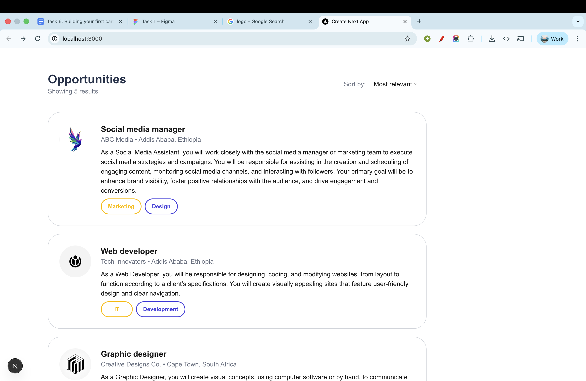
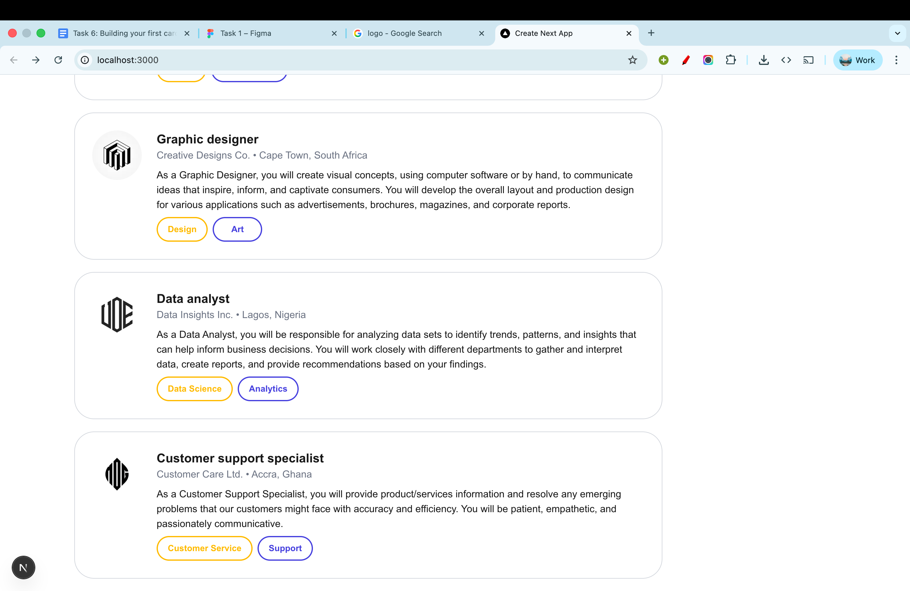
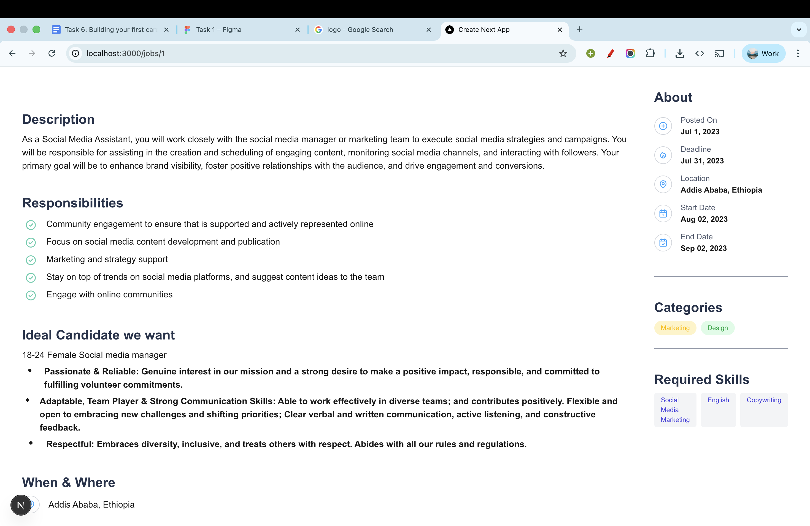

## Overview
This project is a Job Listing Application built to replicate a provided UI design using a fully typed, component-based architecture.

## What It Does
The app loads job data from a JSON file, displays each job through a reusable card component, and uses dynamic routing to render a full job description page that includes responsibilities, ideal-candidate details, scheduling/location info, and required skills.

## Tech Stack
- **Next.js (App Router)**
- **TypeScript**
- **React**
- **Tailwind CSS**
- **Next/Image**
- **Static JSON Data**

## Screen Shots

