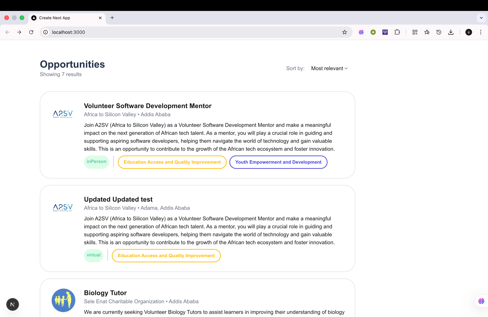
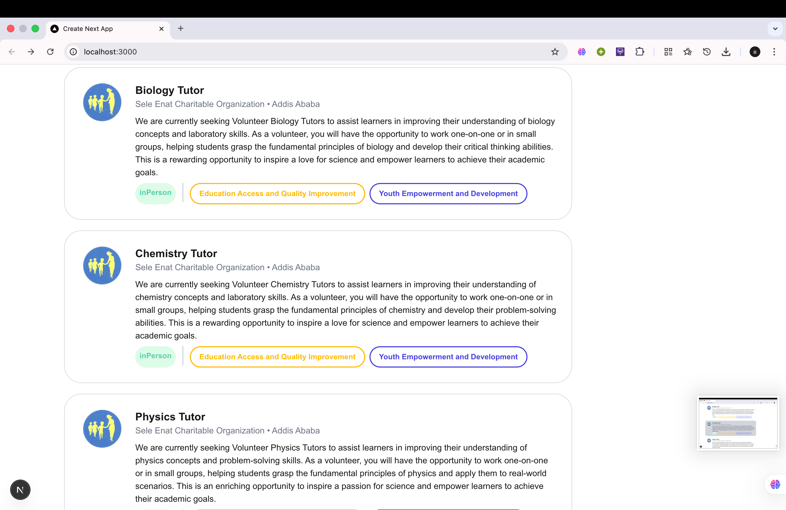
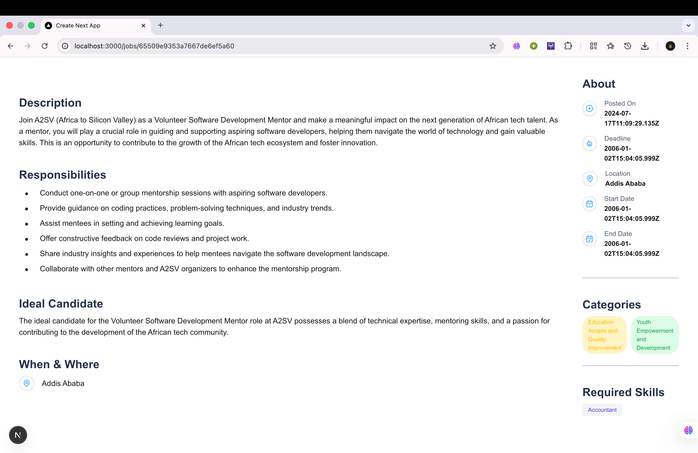

## Overview
This project is a Job Listing Application that fetches real opportunities from a live API and displays them through a fully typed, component‑based Next.js architecture.

## What It Does
The application:
- Fetches job listings from the `/opportunities/search` API endpoint.
- Renders each job inside a reusable `JobCard` component.
- Displays real organization data, categories, logos, and locations returned by the backend.
- Uses dynamic routing (`/jobs/[id]`) to show a full job description page with:
  - Responsibilities (parsed from multiline text)
  - Ideal candidate details
  - Required skills
  - Categories
  - When & where information
  - Organizational metadata (logo, contact info, posting dates)

The entire UI updates dynamically based on the API response—no dummy JSON is used.

## Tech Stack
- **Next.js (App Router — Server Components)**
- **TypeScript**
- **React**
- **Tailwind CSS**
- **Next/Image**
- **API Integration (fetch from live backend)**

## API Used
Base URL:  
`https://akil-backend.onrender.com`

Endpoints:
- **GET** `/opportunities/search` – Fetch all job opportunities  
- **GET** `/opportunities/:id` – Fetch a specific job by ID  

## Screenshots

